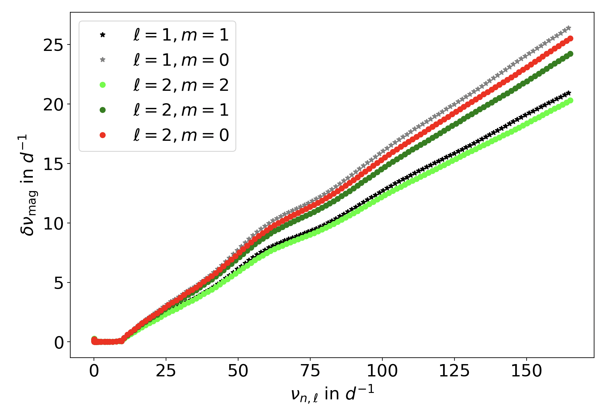

# magsplitpy
Repository to calculate frequency splitting in stars due to general 3D magnetism.

## Installation
This repository is intended to be used as a package in your current working environment. If you do not already have a patent environment, I would recommend installing the `environment.yml` file to get the environment with default name `astero`. You may choose to name it something else by changing the field "name" in the `environment.yml` file.

Assuming you are going to setup `astero` as your working environment, we will go over the installation in four steps: (a) creating the environment, (b) activating the environment, and (c) installing the package `avni` which is used by `magsplitpy` to obtain B-spline basis functions, and (d) installing the package `magsplitpy` in the `astero` environment. This ensures you have the same package dependencies and almost a clone of what the developer has, thereby ensuring a smooth launching of the scripts.

It is recommended to have `mamba` installed in your `base` environment. If you don't already have `mamba`, go to the bottom of this page to see the installation directions and come back here once you have successfully installed it. Next, we create and activate `astero` as follows.
```
# Create the conda environment and install dependencies
mamba env create --file environment.yml

# Activate the conda environment astero
conda activate astero
```
If you choose to not use `astero` and/or use your own patent environment, checkout the packages in the `environment.yml` file and install them manually in your environment (preferably using `conda` or `mamba` so that it automatically resolves the environment and installs the neessary versions).
```
mamba install --yes --file environment.yml
```
We next need to install a package called `avni` for getting the B-splines
```
# Installing avni before installing magsplitpy
mkdir <avni_installation_dir>
cd <avni_installation_dir>
curl --remote-name https://raw.githubusercontent.com/globalseismology/avni/main/requirements_base.txt
mamba install --yes --channel=conda-forge --file requirements_base.txt
git clone https://github.com/globalseismology/avni.git
cd avni
pip install -e .
```
Finally we install `magsplitpy` in the following lines
```
# Install magsplitpy
cd <magplitpy_repo_dir>
pip install -e .
```
The above steps essentially ensure that you can load `magsplitpy` as a package as follows
```
# import the package
from magplitpy import mag_GSH_funcs
```

## Using `magsplitpy` to get frequency splittings
The script `magsplitpy/compute_splittings.py` is supposed to be the front-end driving code that the user should run to get the frequency splittings. It is recommended that the user makes a copy of this code in their local directory for their project instead of changing this in the `magsplitpy` directory. If the user needs to define a new magnetic field topology than what is already present in `magsplitpy/synthetic_B_profiles.py`, then it is recommended that the user also makes a copy of this file in their local project directory. In that case, change the line
```
from magsplitpy import synthetic_B_profiles as B_profiles
```
to
```
import synthetic_B_profiles as B_profiles
```
This is because the local version of this file needs to be accessed.

### Which parts of `compute_splittings.py` needs to be checked or edited by the user
The user needs to primarily check and edit lines under the line
```
if __name__ == "__main__":
```
There are the following crucial components that the user needs to adapt according to their purpose 

### Providing the stellar model
Providing the eigenfunctions and eigenfrequencies of the background stellar model (usually obtained from GYRE) is the first step. This can be done by providing the directory name where the eigenfunction files are saved as follows
```
# path to the directory containing the eigfiles
dir_eigfiles = <name of directory cotaining only the eigenfunction files>
```
### Specifying the units of frequency splittings
For most purposes yet, returning this in `muHz` or `day_inv` has suffised. This can be specified in the following lines
```
# units in which we want the splittings
# currently setup for 'muHz' or 'day_inv'
freq_units = 'day_inv'
```
### Setting up the Lorentz-stress field object
This is possibly the part that takes the most interference from the user. 
```
# the string name for the category of field we want (see magsplitpy/synthetic_B_profiles.py)
B_field_type = 'Bugnet_2021'

# the scaling factor, by default all fields are in some sense normalized
B0 = 50000

# the number of spline knots to be used to discretize the field in radius
user_knot_num = 50

# the maximum angular degree to which magnetic field B is to be decomposed
sB_max = 1

# tilt of the magnetic axis wrt the rotation axis in degrees
mag_obliquity = 75.0
```
The above lines completely define the magnetic field (its topology, how strong it is, how many splines in radius to use for it, highest angular degree and its inclination with respect to the rotation axis. 
### A sample `magsplitpy` run 
This is to test if the installation was successful and the user has `magsplitpy` optimally setup. 
* Download the directory `mode_files` and the file `Field_BC.json` from the Google Drive link: https://drive.google.com/drive/folders/1fviDK9tbWnjr0IjlIW-Pqz821bAfmNKP?usp=share_link
* Create a directory `Vincent_Eig` (just because this is how it is on my system now... should be changed later) in the repository.
* Place `mode_files` inside `Vincent_Eig` and `Field_BC.json` inside `tests` directory.
* `cd magsplitpy`
* `ipython`
* `run compute_splittings.py`

You should see the following plot show up after the code has successfully finished running.



## Installing mamba
It is recommended to install `mamba` in your `base` environment. While there is an option to install `mamba` from `conda-forge` using the usual conda installation as follows
```
conda install -c conda-forge mamba
```
I would recommend not installing it from `conda` (it didn't work for me since I was getting segmentation faults). Instead try to download the following shell script
```
curl -L -O "https://github.com/conda-forge/miniforge/releases/latest/download/Mambaforge-$(uname)-$(uname -m).sh"
```
and run it as 
```
chmod 777 Mambaforge-Darwin-x86_64.sh
./Mambaforge-Darwin-x86_64.sh
```
At this point check if the installation went through by checking
```
mamba --help
```
If it says that `mamba` not found, check where mamba was installed in your system. For me it was `/Users/srijanbharatidas/mambaforge/`. I will call this `<mambaforge_dir>` henceforth. Run the following shell script
```
. <mambaforge_dir>/etc/profile.d/mamba.sh
```
Note that there is a space between `.` and `<mambaforge_dir>`. Next you need to either roboot your terminal and/or re-run the `~/.bash_profile` file as follows
```
source ~/.bash_profile
```
At this point you should have `mamba` working, check again with the following command
```
mamba --help
```
If the above snippet works, then go back to `magsplitpy` installation above.


